```mermaid
graph LR
    A[Full Stack Development] --> B[MERN Stack]
    B --> C[Cloud & DevOps]
    C --> D[IoT & Embedded Systems]
    style A fill:#2E394A
    style B fill:#2E394A
    style C fill:#2E394A
    style D fill:#2E394A
```

<h1 align="center">
  
</h1>

<p align="center">
  
</p>

<div align="center">
  
</div>

<h3 align="center">
  💻 Full-Stack Developer | 🌐 MERN Stack Specialist | 🤖 IoT Enthusiast
</h3>

<div align="center">
  
</div>

---

### 🚀 Quick Overview

- 🔭 I'm currently working on **Full-Stack Web Applications**
- 🌱 I'm exploring **Cloud Architecture & DevOps**
- 👯 Open to collaborate on **Innovative Projects**
- 💬 Ask me about **MERN Stack, IoT, and System Architecture**
- 📫 Reach me at **aakash7536@gmail.com**
- ⚡ Fun fact: I enjoy strategic games and exploring new hobbies that challenge my thinking

### 💡 Core Competencies

```javascript
const skills = {
    frontend: ['React.js', 'JavaScript', 'Tailwind CSS'],
    backend: ['Node.js', 'Express.js', 'Python'],
    databases: ['MongoDB', 'MySQL', 'Firebase'],
    devOps: ['Jenkins', 'Git', 'Docker'],
    other: ['C++', 'Arduino', 'IoT Development']
};
```

### 🛠️ Tech Stack

<p align="center">
  
  
  
  
  
  
  
  
  
  
  
</p>

### 📊 GitHub Analytics

<p align="center">
  
  
</p>

### 🤝 Connect with Me

<p align="center">
  <a href="https://linkedin.com/in/akash-kamble-3874091a3">
    
  </a>
  <a href="mailto:aakash7536@gmail.com">
    
  </a>
</p>

### 🎯 Professional Journey



<div align="center">
  
</div>

---

<p align="center">
  
</p>
